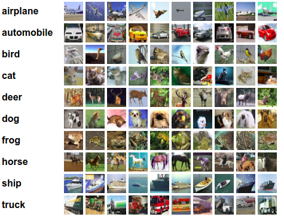

# 用深度学习网络识别 CIFAR-10 图像

## CIFAR-10 数据集



这是一个包含 `10` 个类别的 `RGB` 三通道彩色图片数据集，具有以下特点：

- 数据集图片为 `3` 通道图像而不是灰度图像
- 尺寸为 `32 × 32`
- 有 `50000` 张训练图片和 `10000` 张测试图片

## TensorFlow 官方示例

> Tensorflow 官方示例提供了一份代码 [https://www.tensorflow.org/tutorials/images/deep_cnn](https://www.tensorflow.org/tutorials/images/deep_cnn)

|文 件|用 途|
|---|----|
|cifar10_input.py|在 `TensorFlow` 中加载 `CIFAR-10` 数据集|
|cifar10.py|建立 `CIFAR-10` 模型|
|cifar10_train.py|使用单个 `GPU` 或 `CPU` 训练模型|
|cifar10_multi_gpu_train.py|使用多块 `GPU` 训练模型|
|cifar10_eval.py|使用测试集测试模型的性能|

## Keras 版本

### 简单版本

源码详见目录下的 `simple.ipynb`

#### 导入数据集

可以直接通过内置的 `cifar10` 模块导入数据集，然而下载数据集慢，所以考虑用离线下载。 `keras` 数据集的位置在 `～/.keras/datasets` 下，下载数据集后放到该目录下，再调用 `keras` 的时候就会自动使用本地的数据集。

``` python
(x_train, y_train), (x_test, y_test) = cifar10.load_data()
```

#### 数据预处理

对标签进行 `one-hot` 编码处理

``` python
# 转换为 one-hot 编码
y_train = np_utils.to_categorical(y_train, NB_CLASSES)
y_test = np_utils.to_categorical(y_test, NB_CLASSES)
```

将图像数据转换为 `float` 类型，并且归一化处理

``` python
# float 类型归一化处理
x_train = x_train.astype('float32')
x_test = x_test.astype('float32')
x_train /= 255
x_test /= 255
```

#### 搭建模型

网格采用 `32` 个卷积滤波器，每个大小是 `3 × 3` 。输出的维度和输入的形状相同 `padding='same'` 所以也应该是 `32 × 32` ，并且激活函数是 `ReLU`。之后进行 `2 × 2` 大小的最大池化运算，并关闭 `25%` 的神经元。

``` python
model.add(Conv2D(32, (3, 3), padding='same',
                input_shape=(32, 32, 3)))
model.add(Activation('relu'))
model.add(MaxPooling2D(pool_size=(2, 2)))
model.add(Dropout(0.25))
```

接着使用 `展平层(Flatten)` 接 `512` 个单元构成全连接网络，并用 `ReLU` 激活。

``` python
model.add(Flatten())
model.add(Dense(512))
model.add(Activation('relu'))
```

关闭一半的神经元，加上作为输出的有 `10` 个类的 `softmax` 层，每个类对应一个类别。

``` python
model.add(Dropout(0.5))
model.add(Dense(NB_CLASSES))
model.add(Activation('softmax'))
```

#### 训练模型

训练前先把训练集分为两部分，一部分训练，另一部分验证。训练集用来构建模型，校验集用来选择选择表现最好的方法，测试集是为了在新的未见过的数据上检验模型的性能。

``` python
model.fit(x_train, y_train, batch_size=BATCH_SIZE, epochs=NB_EPOCH,
          validation_split=VALIDATION_SPLIT, verbose=VERBOSE)
```

### 更深的卷积神经网络

> 源码见当前目录下 `v2.ipynb`

上面的准确度只有 `0.6658` 通过定义一个更深的、有更多卷积操作的网络，能够提高模型的准确率

所以这里定义这样一个模型，同样训练 `20` 轮能够达到 `80%` 以上的准确率

``` python
_________________________________________________________________
Layer (type)                 Output Shape              Param #   
=================================================================
conv2d_1 (Conv2D)            (None, 32, 32, 32)        896       
_________________________________________________________________
activation_1 (Activation)    (None, 32, 32, 32)        0         
_________________________________________________________________
conv2d_2 (Conv2D)            (None, 32, 32, 32)        9248      
_________________________________________________________________
activation_2 (Activation)    (None, 32, 32, 32)        0         
_________________________________________________________________
max_pooling2d_1 (MaxPooling2 (None, 16, 16, 32)        0         
_________________________________________________________________
dropout_1 (Dropout)          (None, 16, 16, 32)        0         
_________________________________________________________________
conv2d_3 (Conv2D)            (None, 16, 16, 64)        18496     
_________________________________________________________________
activation_3 (Activation)    (None, 16, 16, 64)        0         
_________________________________________________________________
conv2d_4 (Conv2D)            (None, 14, 14, 64)        36928     
_________________________________________________________________
activation_4 (Activation)    (None, 14, 14, 64)        0         
_________________________________________________________________
max_pooling2d_2 (MaxPooling2 (None, 7, 7, 64)          0         
_________________________________________________________________
dropout_2 (Dropout)          (None, 7, 7, 64)          0         
_________________________________________________________________
flatten_1 (Flatten)          (None, 3136)              0         
_________________________________________________________________
dense_1 (Dense)              (None, 512)               1606144   
_________________________________________________________________
activation_5 (Activation)    (None, 512)               0         
_________________________________________________________________
dropout_3 (Dropout)          (None, 512)               0         
_________________________________________________________________
dense_2 (Dense)              (None, 10)                5130      
_________________________________________________________________
activation_6 (Activation)    (None, 10)                0         
=================================================================
Total params: 1,676,842
Trainable params: 1,676,842
Non-trainable params: 0
_________________________________________________________________
```

### 扩展数据集

> 源码见当前目录下  `v3.ipynb`

深度学习通常要求拥有充足数量的训练样本。一般来说，数据的总量越多，训练得到的模型的效果就会越好。在数据集有限的情况下，通常通过 `数据增强(Data Augmentation)` 来改善模型的训练效果。 `数据增强` 就是对输入的图像进行一些简单的平移、缩放、颜色等颜色变化，这些不会影响图像类别的操作，人工增大训练集样本的个数，从而获得更充足的训练数据，使模型训练的效果更好。

`keras` 已经提供了图像增强的 `API` 直接调用就可以

``` python
from keras.preprocessing.image import ImageDataGenerator
```

`rotation_range` 表示图片旋转的值， `width_shift_range` 和 `height_shift_range` 是对图片做随机水平或垂直变化时的范围， `zoom_range` 是随机缩放图片的变化值， `horizontal_flip` 是对选中的一般图片进行随机的水平翻转， `fill_mode` 表示填充新像素的策略

``` python
datagen = ImageDataGenerator(
rotation_range=40,
width_shift_range=0.2,
height_shift_range=0.2,
zoom_range=0.2,
horizontal_flip=True,
fill_mode='nearest')
```

给上面设置好的图片生成器匹配数据


``` python
datagen.fit(x_train)
```

在训练的时候，调用图片生成器，使生成器针对模型并发运行。可以让图像在 `CPU` 上拓展时， 在 `GPU` 上并行训练。注意，此时训练非常耗时。

``` python
model.fit_generator(datagen.flow(x_train, y_train, batch_size=BATCH_SIZE),
                    steps_per_epoch=x_train.shape[0], epochs=NB_EPOCH, verbose=VERBOSE)
```

关于卷积神经网络的相关内容还可以通过复现一个实战项目练手 [人脸表情识别与卡通化](https://github.com/zhouzaihang/FaceEmotionClassifier)